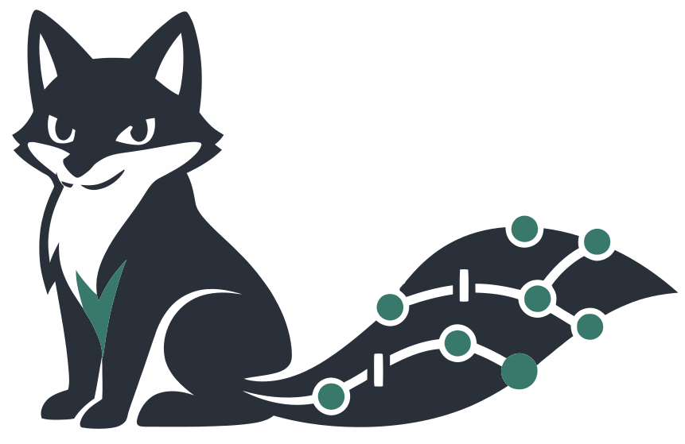

<div align="center">
  
  <h1>traccia</h1>
</div>

<p align="center">
  
  
</p>


---

`traccia` turns personal archives into a skill graph that can explain itself. feed it notes, code, docs, AI chats, exported platform data, and the usual pile of half-structured personal history. it keeps the source files untouched, extracts evidence with timestamps, and renders a graph that shows where a skill came from, how deep it looks, how current it is, and how central it is to the broader archive.

the project is built for mixed archives rather than one clean source of truth. that includes repo history, reddit exports, google activity, social profiles, AI conversation logs, and everything else that tends to accumulate around a real person over time. the point is not to pretend those signals mean the same thing. `traccia` keeps weak signals weak, strong evidence strong, and the trail visible enough to challenge later.

[spec](SPEC.md) | [plan](PLAN.md) | [decisions](decisions.md) | [references](REFERENCES.md)

## why

most archive tools are good at storing material and bad at telling the skill story. most profile tools do the opposite. they compress everything into a pitch, flatten uncertainty, and throw away the evidence trail that would let you inspect the claim later.

`traccia` is trying to keep both sides intact. the files stay raw. the evidence is extracted one source at a time. the graph records when a skill first appeared, when it likely crossed from ambient interest into learned capability, and when there was strong enough proof to treat it as demonstrated work. that makes the output more useful for reflection, review, and long-range memory than a resume-shaped summary.

## install

`traccia` already ships a real console script. `uv run traccia ...` works from the repo, but it is not the only way to use it.

| path | command | result |
| --- | --- | --- |
| repo-local workflow | `uv sync` | keeps `uv run traccia ...` available inside the project |
| bare `traccia` command with live local edits | `uv tool install -e .` | installs the console script on your `PATH` in editable mode |
| standard editable install without `uv tool` | `pip install -e .` | installs the same console script through pip |

if you just want the shortest path from a clone, use the editable tool install once and then call `traccia` directly.

## first run

```bash
uv tool install -e .
traccia init my-traccia
traccia ingest-dir /path/to/archive --project-root my-traccia
traccia tree --project-root my-traccia
traccia explain python --project-root my-traccia
traccia review --project-root my-traccia
traccia export obsidian --project-root my-traccia
traccia viewer --project-root my-traccia
```

for deterministic local testing, switch the generated config to:

```yaml
backend:
  provider: fake
```

for a live model, the current backend contract is an openai-style `v1/chat/completions` endpoint:

```yaml
backend:
  provider: openai_compatible
  model: gpt-5-chat-latest
  api_key_env: OPENAI_API_KEY
  base_url: https://api.openai.com/v1
  api_style: chat_completions
  structured_output_mode: json_schema
```

this is openai-style, not openai-only. any provider that clones the same request and response shape can be used by swapping `base_url`, `model`, and `api_key_env`. the current implementation deliberately targets `chat_completions` because it remains the most commonly copied interface across hosted and self-hosted providers, even if some vendors now prefer newer APIs for their own stacks. for OpenAI specifically, the example uses `gpt-5-chat-latest` because it is a current chat-capable alias that still matches the endpoint this repo implements today.

## backend surface

| key | example | meaning |
| --- | --- | --- |
| `provider` | `openai_compatible` | live LLM backend that speaks an OpenAI-style HTTP contract |
| `model` | `gpt-5-chat-latest` | current chat-capable example model id; replace it with any compatible model your provider exposes |
| `api_key_env` | `OPENAI_API_KEY` | environment variable that holds the credential |
| `base_url` | `https://api.openai.com/v1` | root URL for the compatible endpoint |
| `api_style` | `chat_completions` | the only live API style supported right now |
| `structured_output_mode` | `json_schema` | primary structured-output mode; `json_object` is also supported |

## what it does today

the current build already handles immutable source intake into `raw/imported/`, file-by-file parsing with span tracking, source classification across authored material and activity traces, and evidence extraction that tries to separate real work from ambient interest. the graph layer creates canonical skill nodes, keeps a review queue for uncertain additions, and stores person-specific state such as level, confidence, freshness, historical peak, first seen, first learned, first strong evidence, estimated acquisition timing, acquisition basis, and core-self centrality.

the rendering side produces markdown node pages, profile exports, `graph.json`, `tree.json`, an ascii tree, a local static viewer, and an obsidian vault export with actual note generation instead of a dead folder dump.

## input surface

`traccia` is aimed at mixed personal archives, not just project repos. the current input shape looks like this:

| source class | examples | current treatment |
| --- | --- | --- |
| authored material | markdown, plain text, docs, notes, READMEs | parsed directly and cited back with spans where possible |
| code and technical artifacts | python, js, ts, tsx, rust, go, sql | treated as stronger evidence when they show actual implementation work |
| structured exports | json, csv, pdf, docx | parsed into document records and evidence candidates |
| activity exports | AI conversation JSON, reddit JSON, google activity JSON | normalized into a common structure before evidence extraction |
| broader archive direction | social profiles, issue trackers, twitter or x exports, more takeout-style dumps | explicitly in scope for future expansion, but not all implemented yet |

the intended archive boundary is wider than the current parser list. the system is meant to grow toward bigger archive imports without treating every interaction as equal proof of competence.

## output surface

after ingest, `traccia` renders a graph plus several practical projections around it:

| artifact | purpose |
| --- | --- |
| `tree/index.md` | top-level skill tree snapshot |
| `tree/nodes/*.md` | per-skill pages with evidence, timestamps, related skills, and reasoning |
| `tree/log.md` | render log and longitudinal notes |
| `graph/graph.json` | full graph export for tooling |
| `graph/tree.json` | simplified tree projection |
| `profile/skill.md` | profile-style summary built from the graph |
| `viewer/index.html` | local static viewer |
| `exports/obsidian/` | obsidian-friendly note graph export |

each skill node is meant to answer the questions that normal profile tools dodge. where does this skill fit. what evidence supports it. how deep does the work look. how current is it. when did it first show up. when does it look learned rather than merely noticed. when was there strong enough evidence to trust it. how tightly does it connect back into the rest of the self-model.

## scoring stance

`traccia` keeps current mastery and core-self centrality separate on purpose. those are related, but they are not the same thing. a skill can be central because it keeps showing up across the archive while still being shallow. another skill can be deep but narrow because it only appears in one intense period of work.

that separation matters once you ingest noisy exports. searches, follows, bios, bookmarks, lightweight chats, and stray mentions can support interest, context, or identity. on their own they should not inflate mastery. the system is designed to preserve those lighter signals without letting them pretend to be authored work or repeat implementation evidence.

## command surface

the full command list lives behind `traccia --help`, but the current working surface is already broad enough to use day to day:

| command | use |
| --- | --- |
| `traccia init` | scaffold a new project |
| `traccia doctor` | verify the scaffold and backend config |
| `traccia ingest` / `traccia ingest-dir` | import files into the graph pipeline |
| `traccia rebuild` | recompute the graph from stored material |
| `traccia tree` | print the current tree |
| `traccia explain` / `traccia why` | inspect one skill node |
| `traccia evidence` | list evidence connected to a skill |
| `traccia review` | process uncertain graph changes |
| `traccia alias` | manage canonical aliases |
| `traccia export ...` | write graph, profile, markdown, and obsidian projections |

## repo map

| path | purpose |
| --- | --- |
| `SPEC.md` | product and architecture spec |
| `PLAN.md` | implementation plan and phase boundaries |
| `decisions.md` | decisions and research conclusions |
| `REFERENCES.md` | inspirations and anti-references |
| `src/traccia/` | implementation |
| `tests/` | fixtures and regression coverage |

## verification

the current repo verification path is:

```bash
uv run pytest -q
```

the live external backend path still depends on real credentials and a reachable compatible endpoint. nothing in this README assumes OpenAI specifically. it assumes an OpenAI-style contract.
